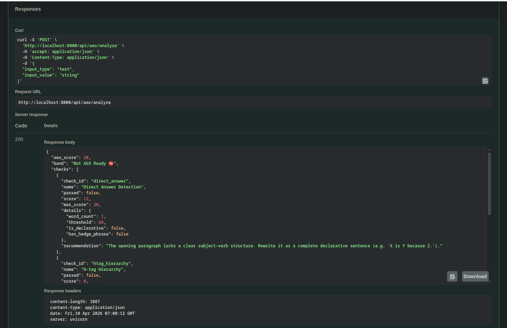
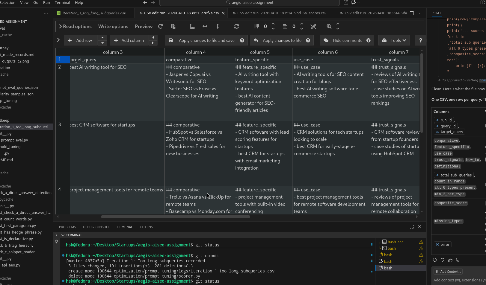
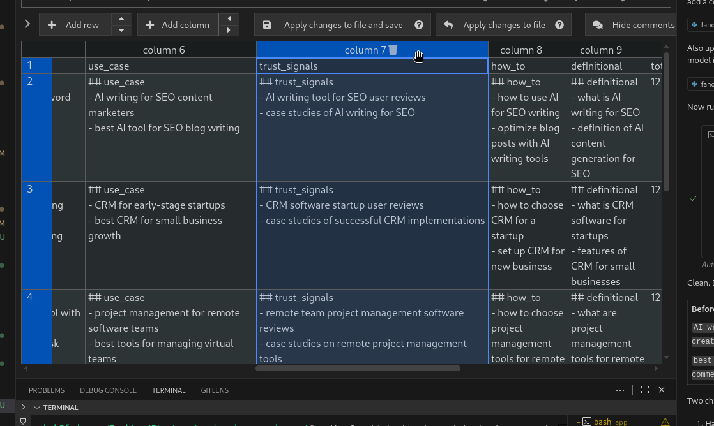
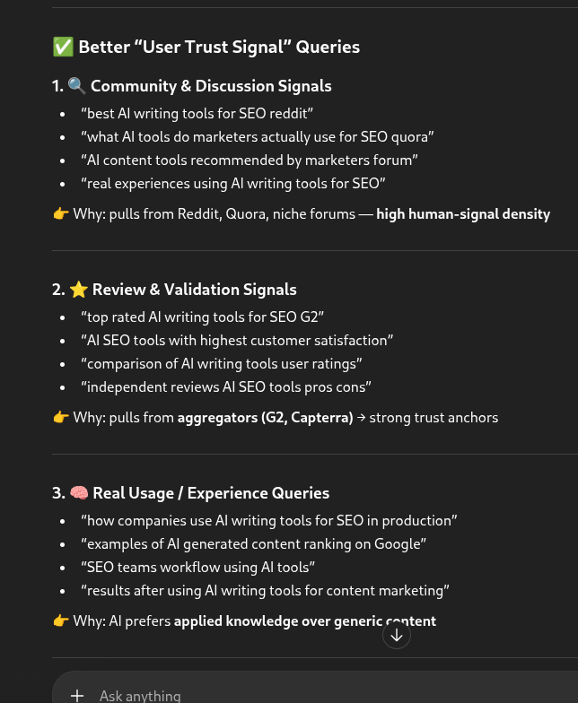
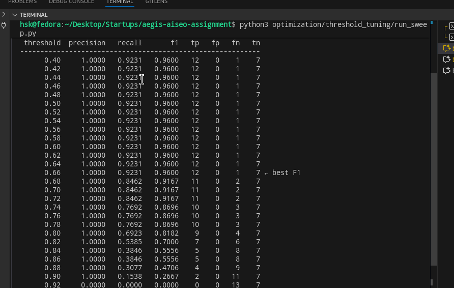

This is my journey on how did I made the whole system, Good for understanding thought process, Approaches and how I used AI + Other tools + Critical thinking to bring up a solution.

First i read whole problem twice/thrice and took an hour and more, Researching more on AEO and SEO before diving deep

Understanding the basic structure, now it's time to code.. before anything I used Copilot Claude 4.6 to generate use AEO module implementation (without checks).. then I ran over the code to get basic outputs like:

Finally now time to check code and start implementing testcases for each modular checks, my plan here is to create dataset first (by reading the whole doc again, and thinking all the edge cases possible), then write it into the testcase engine and only after I am sure I covered everything will I start implementing/tweaking each checks in AEO..

CHecking at code, I noticed the testcase generated has one big file with 50+ cases written for check A, but i felt this is not clean and could be refactored- So tweaking the testcase folder structure to accurately depict each function/module and do unit testing, then on top of these unit tests, I will do one big integration test that will combine each smaller functions..

for here example we have aeo/check_a/test_has_hedge_phrase.py which just checks for hedge phrase

Now I went back to the cases and worked on each checks Step by step- First I noticed there is no check for extracting first paragraph, so I made it and then wrote some edge cases etc to verify if paragraph extract is okay or not- However in testcase and code I noticed how it was skipping paragraph which words less than 3- This is something AI Automatically generated, but since I knew we are deliberately scoring on AEO- We should not skip this and instead take small paragraph only (so we will later highlight / flag this saying this is Poor AEO optimized), therefore I removed the logic where the code skipped over small paragraph

I also deliberately removed more cases like skipping 
 tags inside headers, this is to keep the assignment simple- WHile also writing edge cases there were some instances where i had minor doubts: for example what does: Example of first paragraph break in plain text mean? so i used chatgpt to ask with some examples and aligned test case behaviour accordingly

Similiarly checking into other test cases, words and declarative felt good enough however hedge phrases had few words and I researched what all others can be said / used as hedge phrases / words, So i simply expanded the list to contain more such words

Similiarly I finished other testcases / individual tests, tweking anything required and each folder like aeo/check_... will have a file with name contianing full_integration, it will contain full data and tests for that case <read one of that file and add small example quick here>

Now after generating GEO's structure using LLM, i first tested a basic query and content to see that it is atleast generating- however the important thing which was prompt and the threshold for sentence searches were important, so i built optimizers first- which are just simple script which runs my functions across datasets and help me decide / finalize on prompt and semantic similiarly parameter to identify if covered or not

Finally after setting up the optimizer and a basic prompt engineering- It was time to optimize .. at first attempt the prompt was:
You are a query decomposition engine for an AI content optimisation platform.

YOUR ROLE
You simulate how AI search engines (Perplexity, ChatGPT Search, Google AI Mode) break
a user query into sub-queries before generating a comprehensive answer. Your output is
used to identify gaps in a content article.

TASK
Given a target query, generate between 10 and 15 sub-queries that span all six types
listed below. Cover the query topic thoroughly and generically — the same prompt must
work for any domain (SEO tools, CRM software, project management, etc.).

THE SIX SUB-QUERY TYPES
You must use EXACTLY these identifiers as the "type" field value:

  comparative      — how the subject compares against competitors or alternatives
  feature_specific — a specific feature, capability, or attribute
  use_case         — a concrete real-world application or audience segment
  trust_signals    — reviews, testimonials, case studies, awards, proof points
  how_to           — a procedural, instructional, or "how do I" angle
  definitional     — a conceptual, explanatory, or "what is" angle

HARD CONSTRAINTS
1. Generate at least 2 sub-queries for EVERY type (12 minimum across all six types).
2. Total sub-queries must be between 10 and 15 inclusive.
3. Each sub-query must be a realistic search query string — not a sentence fragment.
4. Return ONLY a valid JSON object. No markdown fences. No prose. No extra fields.
5. The JSON must match this schema exactly:

{
  "sub_queries": [
    {"type": "<one of the six types above>", "query": "<search query string>"},
    ...
  ]
}

EXAMPLE — for target query "best project management software for remote teams":
{
  "sub_queries": [
    {"type": "comparative", "query": "Asana vs Monday.com vs Notion for remote teams"},
    {"type": "comparative", "query": "Jira vs ClickUp for distributed engineering teams"},
    {"type": "feature_specific", "query": "project management tool with async video updates"},
    {"type": "feature_specific", "query": "PM software with time zone management features"},
    {"type": "use_case", "query": "project management software for remote marketing agencies"},
    {"type": "use_case", "query": "best PM tool for fully distributed startup teams"},
    {"type": "trust_signals", "query": "project management software reviews from remote-first companies"},
    {"type": "trust_signals", "query": "Monday.com vs Asana case studies remote work 2025"},
    {"type": "how_to", "query": "how to manage remote team projects with no meetings"},
    {"type": "how_to", "query": "how to track distributed team progress in real time"},
    {"type": "definitional", "query": "what is asynchronous project management"},
    {"type": "definitional", "query": "definition of remote-first project workflow"}
  ]
}

Now generate sub-queries for the target query provided by the user.\

and output as we see by comparisons:

Check file at: optimization/prompt_tuning/logs/iteration_1_too_long_subqueries.csv

This was good but i was noticing a lot of big subquery sentences for example i saw:
## use_case
- AI writing tools for SEO content creation for blogs
- best AI writing software for e-commerce SEO

for "best AI writing tool for SEO"

that "AI writing tools for SEO content creation for blogs" felt wrong.. so we improved

To improve this, I added instructions for:
4. Keep each query concise: 4–9 words maximum. No redundant prepositions or filler
   words (avoid patterns like "X for Y for Z" — collapse to "X for Y Z" instead).
5. Write queries the way a real user would type them into a search engine — natural,
   direct, no unnecessary repetition.

and there was a line which said to follow the example / structure exactly.. removing it did the trick

Next when I made the iteration.. It all felt good except trust signals which is:

Notice how some of the signals generated were:
"## trust_signals
- AI writing tool for SEO user reviews
- case studies of AI writing for SEO"
"## trust_signals
- CRM software startup user reviews
- case studies of successful CRM implementations"

I don't think people ask for "case studies" or "user reviews" I think they write more generic terms like 'best' or AI Writing tools with best reviews, etc.. just to confirm i went back and researched internet + chatgpt to finetune the signals.. 

I came across some resources / reddit posts which then i used chatgpt to critize and summarize against previously generated posts- it gave certain examples like:

Incorporating the same feedback, I iterated the prompt for third time by changing sample examples for trust signals.. final examples became:
{"type": "trust_signals", "query": "project management tools used by large teams"},
{"type": "trust_signals", "query": "most popular PM software among engineering teams"},

Some more things I could do / future plan- Honestly this pipeline is still very primitive- If not for assignment, a real production use system will use perhaps a more complex pipelined based structure where I will have one prompt to generate subqueries of each type.. so for example a for each type ie we will cal 5 prompts, each prompt generate a single categorry.. then we will run each query against critic and an incorporation component which will finetune / improve the subqeury even further..

<give example with one situation / dummy etc>

Plus since hardcoded examples are given, there is high chance LLM will overfit on those instances- a more dynamic bank of examples could be used as per industry / usecase etc

Final CSV containing final LLM outputs:-> <previous path of same folder etc>/final_iteration_kept_results.csv

Now it's time to optimize the parameter for threshold / covered matching

# To tune threshold.. i used the parameter tuning script which is run by:
python3 optimization/threshold_tuning/run_sweep.py
how it works is it takes list of hand labelled samples for example:
  {
    "id": "s001",
    "sub_query": "how does Jasper AI compare to human writers for SEO content",
    "query_type": "comparative",
    "content_chunk": "We ran a head-to-head comparison between Jasper AI-generated articles and content written by professional SEO copywriters. AI content scored higher on keyword density but lower on narrative depth.",
    "label": true
  },

and runs the script to find the best F1 score match across different threshold, which we finalise as our optimum value.. ie:

you can take a look at optimization/threshold_tuning/reports/pair_scores_20260410_194820.csv to understand the covering scores and labels etc

Then I worked on testcases file again, the gap analysis was simple but for query fanout i explicitly had two kinds of testcases, offline which are mocked (to test errors, edge cases, etc) and online simple tests that checks basic sanity again live system 